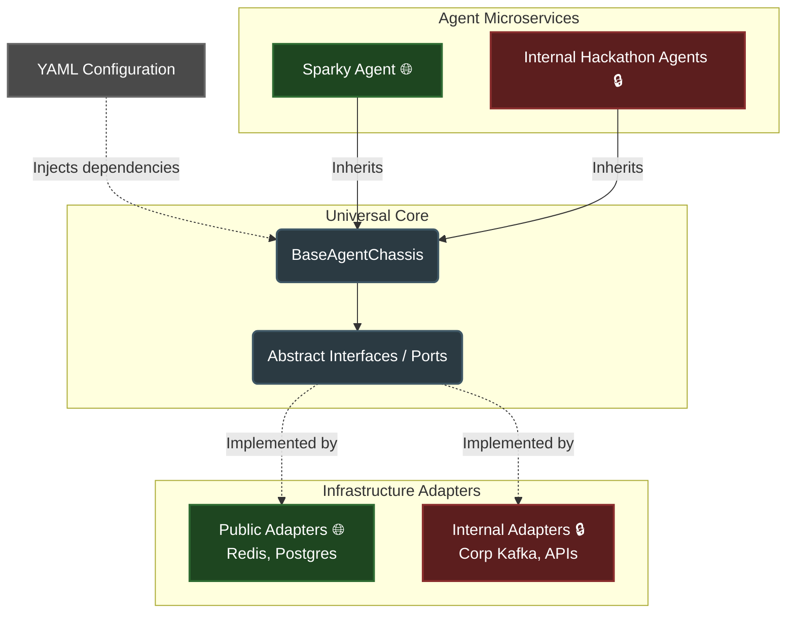

# AI Agent Engineering Framework

## Overview
This repository is a framework and playbook for building distributed AI agents using the Google Agent Development Kit (ADK) and Python. 

It is designed for **Agent-Driven Development**. If you are comfortable with Git, the command line, and prompt engineering (using tools like Gemini CLI or Antigravity) but have zero familiarity with developing AI agents, this repo will kick-start that process. We provide the architectural guardrails, playbooks, and AI instructions needed to safely direct your AI assistants to write the code for you.

## Quick Start (Hackathon Setup)
To instantly set up your local environment, clone the repo, and initialize your AI CLI with the correct guardrails, run this single command in your terminal:

```bash
bash -c "$(curl -fsSL https://raw.githubusercontent.com/imraytiong/agentic-dev/main/scripts/start_hackathon.sh)"
```
*(Note: Ensure you have `python3` and `gemini` CLI installed before running).*

**Next Steps:**
The setup script will automatically drop you directly into the Gemini CLI. Once inside the CLI, load the agent builder skill to begin:
```text
> /load skills/adk-agent-builder/SKILL.md
```

## System Architecture

The codebase relies on a Hexagonal (Ports & Adapters) architecture that allows us to maintain an open-source core while building proprietary logic safely on top of it.


*(Legend: 🌐 = Open Source / Public Repository, 🔒 = Corporate Internal Repository)*

## Directory Structure

*   **[src/agents/](src/agents/)** — Active or reference agent implementations (e.g., our baseline test agent, `sparky_spec.md`). Code for agents goes here.
*   **[src/infrastructure/](src/infrastructure/)** — Where the Hexagonal Adapters live (e.g., standard Redis, Postgres) and the `fleet_infrastructure_spec.md`. Code for infrastructure goes here.
*   **[src/universal_core/](src/universal_core/)** — The sealed Universal Core (`BaseAgentChassis`), system contracts, boundaries, and the `universal_core_architecture_spec.md`.
*   **[developer_guides/](developer_guides/)** — The core playbooks and instructions. This is where human developers learn how to build and direct agents.
*   **[spec_templates/](spec_templates/)** — Templates for technical specifications (e.g., agents, adapters).
*   **[skills/](skills/)** — Pre-packaged AI CLI instructions (`SKILL.md` files). Load these into your AI coding assistant to enforce our architectural rules during code generation.
*   **[internal_ignore/](internal_ignore/)** — **Safe to ignore.** For the curious: this contains internal workspace files, architectural decision logs, and hackathon planning scratchpads for the core maintainers. 

## Where to Start

Depending on what you want to build, choose your role and follow the entry point:

### 1. Agent Developers
*Your focus: Writing business logic, tools, and prompts. You do not need to worry about infrastructure.*
*   **Concepts:** [1_agent_concepts.md](developer_guides/agent_developers/1_agent_concepts.md)
*   **Start Building:** [2_agent_builder_playbook.md](developer_guides/agent_developers/2_agent_builder_playbook.md)
*   **Code Reference:** [3_code_reference.md](developer_guides/agent_developers/3_code_reference.md)
*   **Deep Topics (Homework):** [4_agent_deep_topics.md](developer_guides/agent_developers/4_agent_deep_topics.md)

### 2. Infrastructure Developers
*Your focus: Deployments, containers, adapters, and mapping the environment (Docker/K3s).*
*   **Concepts:** [1_infrastructure_concepts.md](developer_guides/infrastructure_developers/1_infrastructure_concepts.md)
*   **Start Building:** [2_infrastructure_playbook.md](developer_guides/infrastructure_developers/2_infrastructure_playbook.md)
*   **Code Reference:** [3_core_internals_reference.md](developer_guides/infrastructure_developers/3_core_internals_reference.md)
*   **Deep Topics (Homework):** [4_infrastructure_deep_topics.md](developer_guides/infrastructure_developers/4_infrastructure_deep_topics.md)

### 3. Architecture Developers
*Your focus: Maintaining the sealed Universal Core (`BaseAgentChassis`), system contracts, and boundaries.*
*   **Concepts:** [1_architecture_concepts.md](developer_guides/architecture_developers/1_architecture_concepts.md)
*   **Start Building:** [2_architecture_playbook.md](developer_guides/architecture_developers/2_architecture_playbook.md)
*   **Code Reference:** [3_architecture_reference.md](developer_guides/architecture_developers/3_architecture_reference.md)
*   **Deep Topics (Homework):** [4_architecture_deep_topics.md](developer_guides/architecture_developers/4_architecture_deep_topics.md)

### Codelabs
We have prepared a set of Codelabs to get you up to speed quickly during the hackathon:
* [Codelab 1: Hello Sparky!](learn/codelabs/1_hello_sparky.md) - Environment setup and running your first agent.
* [Codelab 2: Upgrading Sparky](learn/codelabs/2_upgrading_sparky.md) - Adding tools and modifying agent behavior using the AI CLI.
* [Codelab 3: AndroidX Intelligence Agent](learn/codelabs/3_androidx_intelligence_agent.md) - Advanced offline challenge to build a real-world DevRel assistant.
* [Codelab 4: Capstone - Build Your Own Agent](learn/codelabs/4_capstone_build_your_own.md) - Take a rough idea, write a spec, and direct the CLI to build your custom agent.
