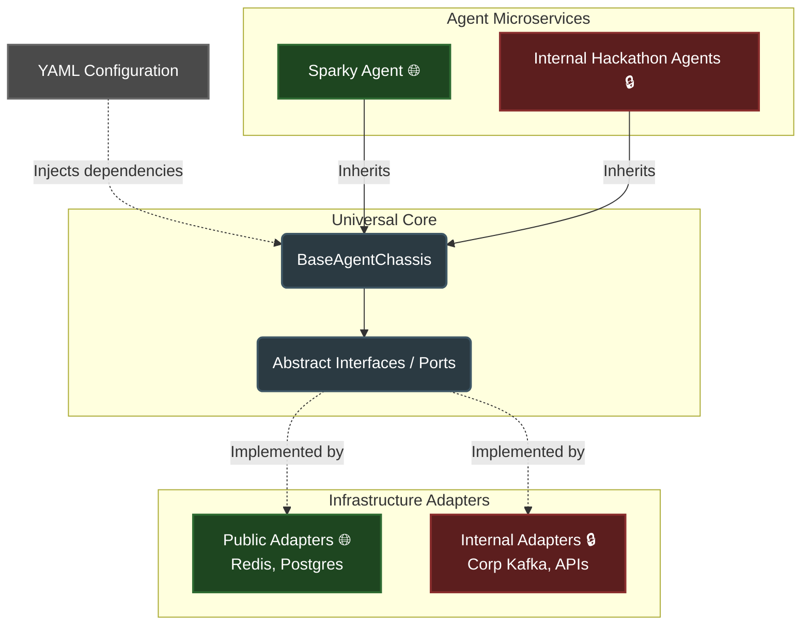

# AI Agent Engineering Framework

## Overview
This repository is a framework and playbook for building distributed AI agents using the Google Agent Development Kit (ADK) and Python. 

It is designed for **Agent-Driven Development**. If you are comfortable with Git, the command line, and prompt engineering (using tools like Gemini CLI or Antigravity) but have zero familiarity with developing AI agents, this repo will kick-start that process. We provide the architectural guardrails, playbooks, and AI instructions needed to safely direct your AI assistants to write the code for you.

## System Architecture

The codebase relies on a Hexagonal (Ports & Adapters) architecture that allows us to maintain an open-source core while building proprietary logic safely on top of it.

*(Legend: 🌐 = Open Source / Public Repository, 🔒 = Corporate Internal Repository)*

## Directory Structure

*   **[src/agents/](src/agents/)** — Active or reference agent implementations (e.g., our baseline test agent, `sparky_spec.md`). Code for agents goes here.
*   **[src/infrastructure/](src/infrastructure/)** — Where the Hexagonal Adapters live (e.g., standard Redis, Postgres) and the `fleet_infrastructure_spec.md`. Code for infrastructure goes here.
*   **[src/universal_core/](src/universal_core/)** — The sealed Universal Core (`BaseAgentChassis`), system contracts, boundaries, and the `universal_core_architecture_spec.md`.
*   **[developer_guides/](developer_guides/)** — The core playbooks and instructions. This is where human developers learn how to build and direct agents.
*   **[spec_templates/](spec_templates/)** — Templates for technical specifications (e.g., agents, adapters).
*   **[skills/](skills/)** — Pre-packaged AI CLI instructions (`SKILL.md` files). Load these into your AI coding assistant to enforce our architectural rules during code generation.
*   **[internal_ignore/](internal_ignore/)** — **Safe to ignore.** For the curious: this contains internal workspace files, architectural decision logs, and hackathon planning scratchpads for the core maintainers. 

## Where to Start

Depending on what you want to build, choose your role and follow the entry point:

### 1. Agent Developers
*Your focus: Writing business logic, tools, and prompts. You do not need to worry about infrastructure.*
*   **Start Here:** [00_start_here.md](developer_guides/agent_developers/00_start_here.md)
*   **Concepts:** [Conceptual Guide](developer_guides/agent_developers/conceptual_guide.md)

### 2. Infrastructure Developers
*Your focus: Deployments, containers, adapters, and mapping the environment (Docker/K3s).*
*   **Start Here:** [Infrastructure Director Guide](developer_guides/infrastructure_developers/infrastructure_director_guide.md)

### 3. Architecture Developers
*Your focus: Maintaining the sealed Universal Core (`BaseAgentChassis`), system contracts, and boundaries.*
*   **Start Here:** [Architect Director Guide](developer_guides/architecture_developers/architect_director_guide.md)
