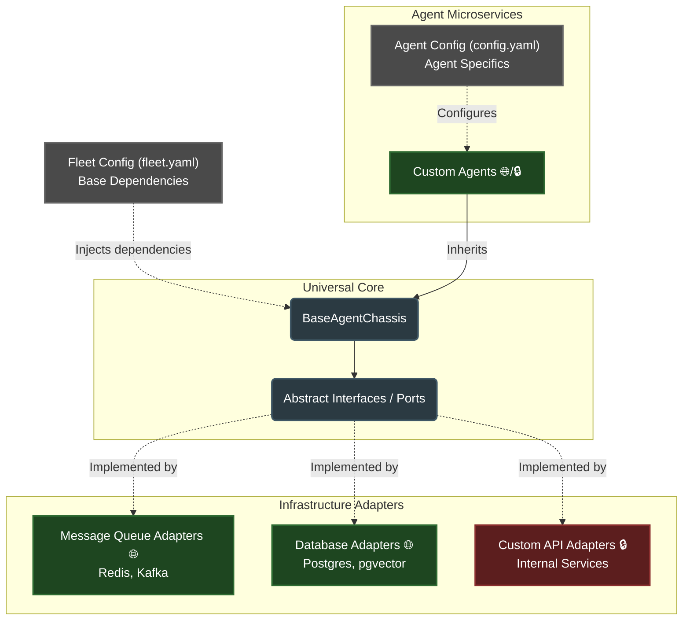

# AI Agent Engineering Framework

## Overview
This is a harness and playbook for building AI agents using the Google Agent Development Kit (ADK) and Python.   It includes a ready to use in-memory mock infrastructure that you can run right away without having to set any infrastructure up. 
## Agentic Driven Development
This harness was built around the concept of specification driven development. The harness itself was developed using Gemini CLI, a custom skill, and a process that centered around defining specifications.  Similarly the repo provides an [adk-agent-builder](skills/adk-agent-builder/SKILL.md) skill  that provides guardrails and procedures for your agent tool of choice to build agents starting with a well defined specification.
## System Architecture

The codebase provides architecture that allows agent developers to focus on the agent prompts, tools, and agent logic.  Adapters can be built and swapped for specific deployment infrastructure independent of the agent so long it provides capabilities per the adapter contract defined. 


```mermaid
flowchart TD
    %% Styling
    classDef core fill:#2b3a42,stroke:#3f5765,stroke-width:2px,color:#fff;
    classDef public fill:#1e4620,stroke:#2e6b32,stroke-width:2px,color:#fff;
    classDef private fill:#5c1e1e,stroke:#8a2e2e,stroke-width:2px,color:#fff;
    classDef cfgNode fill:#4a4a4a,stroke:#666666,stroke-width:2px,color:#fff;

    %% Nodes
    FleetConfig["Fleet Config (fleet.yaml)<br/>Base Dependencies"]:::cfgNode

    subgraph CoreLayer [Universal Core]
        Chassis(BaseAgentChassis):::core
        Interfaces(Abstract Interfaces / Ports):::core
        Chassis --> Interfaces
    end

    subgraph AgentLayer [Agent Microservices]
        AgentConfig["Agent Config (config.yaml)<br/>Agent Specifics"]:::cfgNode
        CustomAgents["Custom Agents 🌐/🔒"]:::public
        AgentConfig -. Configures .-> CustomAgents
    end

    subgraph InfraLayer [Infrastructure Adapters]
        MsgQueue["Message Queue Adapters 🌐<br/>Redis, Kafka"]:::public
        DBAdapter["Database Adapters 🌐<br/>Postgres, pgvector"]:::public
        CustomAPI["Custom API Adapters 🔒<br/>Internal Services"]:::private
    end

    %% Connections
    FleetConfig -. Injects dependencies .-> Chassis
    CustomAgents -- Inherits --> Chassis

    Interfaces -. Implemented by .-> MsgQueue
    Interfaces -. Implemented by .-> DBAdapter
    Interfaces -. Implemented by .-> CustomAPI
```
*(Legend: 🌐 = Open Source / Public Repository, 🔒 = Corporate Internal Repository)*

## Directory Structure

*   **[src/agents/](src/agents/)** — Active or reference agent implementations. Code for agents goes here.
*   **[src/infrastructure/](src/infrastructure/)** — Where the Hexagonal Adapters live (e.g., standard Redis, Postgres) and the `fleet_infrastructure_spec.md`. Code for infrastructure goes here.
*   **[src/universal_core/](src/universal_core/)** — The sealed Universal Core (`BaseAgentChassis`), system contracts, boundaries, and the `universal_core_architecture_spec.md`.
*   **[developer_guides/](developer_guides/)** — The core playbooks and instructions. This is where human developers learn how to build and direct agents.
*   **[spec_templates/](spec_templates/)** — Templates for technical specifications (e.g., agents, adapters).
*   **[skills/](skills/)** — Pre-packaged AI CLI instructions (`SKILL.md` files). Load these into your AI coding assistant to enforce our architectural rules during code generation.
*   **[internal_ignore/](internal_ignore/)** — **Safe to ignore.** For the curious: this contains internal workspace files, architectural decision logs, and hackathon planning scratchpads for the core maintainers. 

## Setting up your environment
Before running the quick start script, you **must** have the following installed on your machine:
-  **Python 3** 
- **Gemini CLI** 

To  set up your local environment, clone the repo, and initialize your AI tool of choice with the correct guardrails, run this single command in your terminal:
```bash
bash -c "$(curl -fsSL https://raw.githubusercontent.com/imraytiong/adk-harness/main/scripts/start_hackathon.sh)"
```

**What this script does:**
* Checks your environment for Gemini CLI and Python3 
* Checks your Gemini API Key is valid
* Creates and activates a Python virtual environment (`venv`).
* Installs Gemini CLI Conductor extension
* Installs all required framework dependencies (`pip install -r requirements.txt`).
## Start building
Or alternatively you can start building right away. Alternatively if you prefer a guided learning pathway check out the [learning-guide](learn/learning-guide.md) for progressive codelabs if you prefer a more guided approach.
### 1. Agent Developers
*Your focus: Writing business logic, tools, and prompts. You do not need to worry about infrastructure.*
*   [Concepts](developer_guides/agent_developers/1_agent_concepts.md)
*   [Start Building](developer_guides/agent_developers/2_agent_builder_playbook.md)
*   [Code Reference](developer_guides/agent_developers/3_code_reference.md)
*   [Deep Topics (Homework)](developer_guides/agent_developers/4_agent_deep_topics.md)
### 2. Infrastructure Developers
*Your focus: If you're looking to developer additional connectors so that you can use this harness your specific deployment needs start here:
*   [Concepts](developer_guides/infrastructure_developers/1_infrastructure_concepts.md)
*   [Start Building](developer_guides/infrastructure_developers/2_infrastructure_playbook.md)
*   [Code Reference](developer_guides/infrastructure_developers/3_core_internals_reference.md)
*   [Deep Topics (Homework)](developer_guides/infrastructure_developers/4_infrastructure_deep_topics.md)
### 3. Architecture Developers
*Your focus: If you want to contribute to the harness infrastructure or fork it for your own needs start here:
*   [Concepts](developer_guides/architecture_developers/1_architecture_concepts.md)
*   [Start Building](developer_guides/architecture_developers/2_architecture_playbook.md)
*   [Code Reference](developer_guides/architecture_developers/3_architecture_reference.md)
*   [Deep Topics (Homework)](developer_guides/architecture_developers/4_architecture_deep_topics.md)
