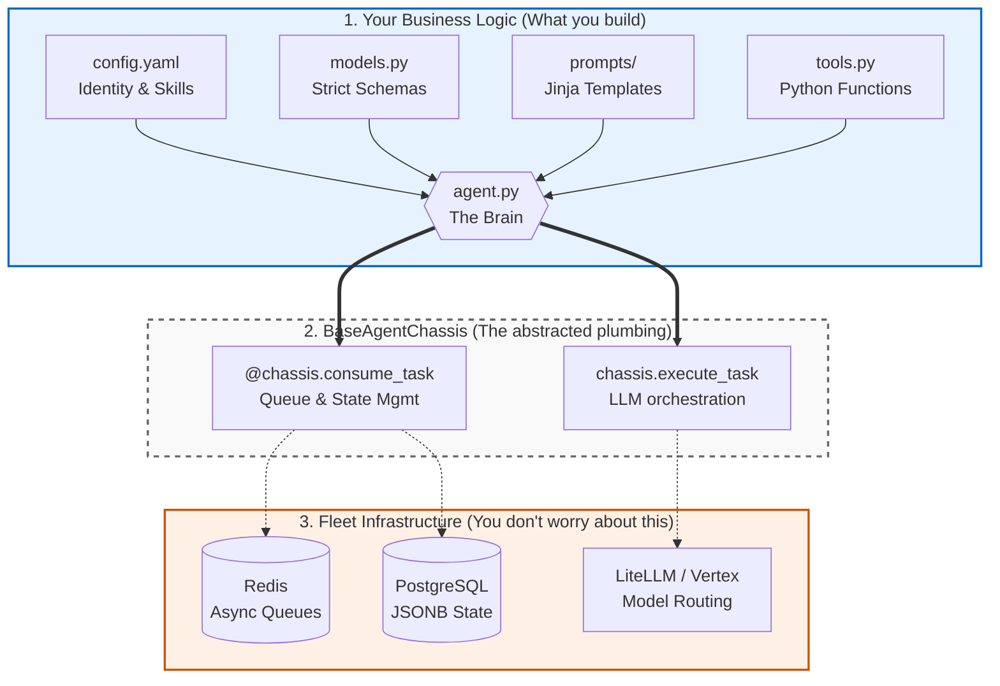

# 1. Agent Concepts & Theory

**Tags:** #conceptual #onboarding #architecture #workflows
**Status:** Active Reference

Welcome to the Agent Developer track! Before we look at code, we need to shift how we think about building software. This guide covers the theory behind autonomous agents, the boundaries of your responsibilities, and the standard architectural patterns we use.

---

## 1. What is an "Agent"?

In traditional software, you write explicit `if/then` rules. If a user clicks a button, the code executes exactly steps 1, 2, and 3 in order. It is highly predictable, but it breaks if the user does something unexpected.

An **Agent** is simply a standard software service (like an API or a background worker) with a reasoning engine at its core. 

Instead of writing every `if/then` branch, you give the Agent:
1.  **A Goal:** "Find the error in this dataset."
2.  **Tools:** A set of standard functions it is allowed to use (e.g., `read_file`, `query_database`).
3.  **Rules:** "Do not delete any data. If you get stuck, ask for help."

The Agent reads the user's request, looks at its available tools, and autonomously decides which tools to run and in what order to achieve the goal. It is software that can plan, execute, evaluate its own work, and correct its own mistakes.

### Why not just use a prompt?
*   **Action vs. Text:** A prompt generates text. It cannot *do* anything. An agent has "hands" (Tools). It can read a live database, parse a massive source repo, click a button, or send an email on your behalf.
*   **The Loop vs. The One-and-Done:** A prompt is a single transaction. You ask, it answers, and it stops. An agent operates in a continuous loop. If an agent tries to query a database and gets an error, it doesn't give up. It reads the error, realizes it made a typo, fixes the query, and tries again—autonomously.
*   **Context Management:** AI models have a limited "context window". Agents solve this through Context Management. The platform stores massive amounts of data in long-term memory, and the agent autonomously retrieves *only the relevant paragraphs* to inject into its working memory.

---

## 2. Your Responsibilities (What You Build)

When you are tasked with building a new Agent, you are acting as the "Brain Architect" and the "Toolsmith." You will focus entirely on business logic. 

Here is a visual breakdown of what you own versus what the platform handles:

You will build four conceptual pieces:
*   **The Identity (Configuration):** Tells the system the Agent's name, which AI model it should use, and which tools it is allowed to access.
*   **The Brain (Instructions & Rules):** The Agent's core instructions in plain English text files (Jinja/Markdown).
*   **The Hands (Tools):** Standard software functions to interact with the outside world.
*   **The Controller (agent.py):** The dynamic business logic, orchestration, and state mutations.

---

## 3. The Multi-Agent System (MAS) & Standard Workflows

If you give a single AI too many instructions and too many tools, it gets confused, hallucinates answers, and becomes slow. Instead, we build a **Multi-Agent System (MAS)**—a "Society of Minds." 

Here are the standard architectural patterns we use when designing agents:

### A. The Supervisor / Router Pattern (The Front Door)
The user never interacts directly with a heavy, slow, specialized agent. Instead, all requests hit a Supervisor agent.
*   **Deterministic Semantic Routing:** The user's prompt is embedded and compared against known capabilities. If confident, it routes instantly.
*   **LLM Fallback:** If ambiguous, a fast LLM evaluates the available routing tools and makes a dynamic decision.

### B. The Plan-and-Execute Pattern (For Complex Tasks)
When a user asks a multi-step, complex question, standard agents get stuck in loops.
*   **The Planner:** Takes the high-level goal and generates a strict, linear JSON array of steps.
*   **The Executor:** Takes the plan step-by-step. Executes tools for Step 1, saves the result to long-term memory, and moves to Step 2.

### C. The Evaluator-Optimizer Pattern (The "Ralph Loop")
For high-stakes outputs (like writing code or strict JSON), we do not return the first draft.
*   **The Drafter:** Generates the initial output.
*   **The Evaluator:** Reviews the output against criteria or runs a deterministic Python test tool.
*   **The Loop:** If it fails, the Evaluator feeds the error back to the Drafter to fix it. This loops until the test passes.

---

## 4. The MAS Threshold: When to Split an Agent

Knowing exactly *when* to break a single agent into a Multi-Agent System (MAS) is critical. Watch for these **Four Thresholds**:

1.  **The "Schizophrenic Persona":** Your system prompt contains conflicting instructions (e.g., "be highly creative but strictly analytical"). **Split:** Create the Debate Pattern (Drafter vs. Critic).
2.  **The "Tool Overload":** Your agent has more than 5-7 complex tools and starts hallucinating arguments. **Split:** Create the Manager & Specialist Pattern.
3.  **The "Speed vs. Brains" Conflict:** You have a fast, high-volume task mixed with a slow, high-reasoning task. **Split:** Create the Factory Line Pattern (Fast sorter, slow specialist).
4.  **The "Context Window Blowout":** The agent needs to read 50 massive PDFs. **Split:** Create the Map-Reduce Pattern (50 Worker Agents to summarize, 1 Synthesizer Agent).

***
*Ready to start building? Move on to [2_agent_builder_playbook.md](2_agent_builder_playbook.md).*