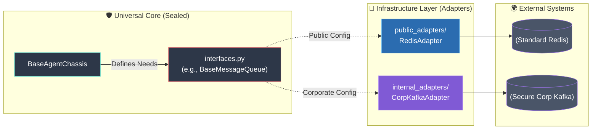

# 1. Infrastructure Concepts (The Theory)

**Target Audience:** Infrastructure Leads / Platform Engineers
**Goal:** Understand the Hexagonal Architecture and the "Open Core" model that powers the agent fleet.

While the Agent Developers are building the "Brains", your job is to build the "Spine" of the system. 

We use a **Hexagonal Architecture (Ports and Adapters)** approach with **True Inversion of Control (IoC)**. You are *not* building the `BaseAgentChassis` from scratch. The "Universal Core" (`src/universal_core/chassis.py`) is sealed, pre-built, and strictly owned by the Architect. Your job is to build the **Operational Adapters** in the `src/infrastructure/` directory that connect that core to the real world.

## Why We Use Adapters (The "Open Core" Model)
Adapters allow our Universal Core to remain completely agnostic to the environment it runs in. This is crucial for our dual-remote setup: we can use standard open-source tools on our local machines, but instantly swap to proprietary corporate systems during the hackathon *without changing a single line of the core agent code*. You just update the YAML config!

## The Dual Remote Git Strategy
Because we are building proprietary adapters during a hackathon, we must protect our IP.
* **`main` branch (Public):** Contains Universal Core + `public_adapters/`. Pushed to GitHub.
* **`hackathon` branch (Corporate):** Contains Universal Core + `public_adapters/` + `internal_adapters/`. Pushed ONLY to the internal corporate Git server.

By physically separating the adapters into `public_adapters/` and `internal_adapters/`, and using YAML to dynamically load them, the Universal Core never has to explicitly import or "know" about the secure corporate code.