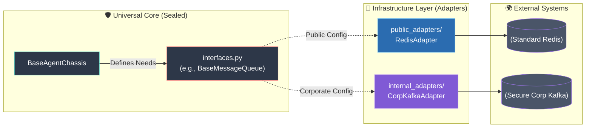

# Infrastructure Director Guide

**Target Audience:** Infrastructure Leads / Platform Engineers (Role 2)  
**Goal:** Using AI CLIs to generate the Operational Adapters, Docker networks, K3s manifests, and OpenTelemetry configurations.

While the Agent Developers (Role 3) are building the "Brains" using the `adk-agent-builder` skill, your job is to build the "Spine" of the system. 

We use a **Hexagonal Architecture (Ports and Adapters)** approach with **True Inversion of Control (IoC)**. You are *not* building the `BaseAgentChassis` from scratch. The "Universal Core" (`src/universal_core/chassis.py`) is sealed, pre-built, and strictly owned by **The Architect (Role 1)**. Your job is to build the **Operational Adapters** in the `src/infrastructure/` directory that connect that core to the real world.

### Why We Use Adapters (The "Open Core" Model)
Adapters allow our Universal Core to remain completely agnostic to the environment it runs in. This is crucial for our dual-remote setup: we can use standard open-source tools on our local machines, but instantly swap to proprietary corporate systems during the hackathon *without changing a single line of the core agent code*. You just update the YAML config!

## The Interface-First Bootstrap Protocol

To completely unblock the rest of the hackathon team, you will follow this 3-phase protocol:

### Phase 1: The Immediate Handoff (Minute 1)
The Agent Developers need the `BaseAgentChassis` immediately so they can start testing their prompts and logic.
1. Take the pre-built `src/universal_core/chassis.py` file (which contains the Universal Core and `mock_infrastructure=True` logic) and `src/universal_core/interfaces.py` provided by the Architect.
2. Hand these directly to the Agent Developers. 
3. **Result:** They are now 100% unblocked and can build agents in their Mac terminals.

### Phase 2: Generating the Adapters (OBSERVE & THINK)
Now that the team is coding, you focus on the real infrastructure.
1. Open your AI CLI (Gemini CLI / Conductor).
2. Type: `load adk-infra-builder` (view the skill instructions here: **[adk-infra-builder](../../skills/adk-infra-builder/SKILL.md)**)
3. Provide the AI with the **[Fleet Infrastructure Spec](../../src/infrastructure/fleet_infrastructure_spec.md)** (found in your `src/infrastructure` folder).

The AI CLI is programmed to read the Spec and understand that it only needs to generate the missing Adapters (Postgres, Message Broker, OTel) in the `src/infrastructure/` folder and the Docker manifests. It will NOT touch `src/universal_core/chassis.py`.

### Phase 3: Execution & Verification (ACT & VERIFY)
The AI will generate the `docker-compose.yml`, `Dockerfile`, `fleet.yaml`, and the adapter files (e.g., `src/infrastructure/public_adapters/postgres.py`).

You must verify the network works:
1.  **The Spin-Up Test:** Run your deployment command (see "Container Engine Resilience" below). Do Postgres, the Message Broker, and Phoenix start cleanly?
2.  **The Health Check Test:** Curl the `/health` and `/ready` endpoints of the Chassis to ensure FastAPI is reporting correctly.
3.  **The Hello World Test:** Deploy **[Sparky Spec](../../src/agents/sparky_spec.md)** (Sparky) into your network with `mock_infrastructure=False` and verify the telemetry traces appear in Arize Phoenix.

---

## Container Engine Resilience (Docker vs. Podman vs. Colima)
Because our infrastructure is strictly **OCI-Compliant**, we do not need to write Python adapters for different container engines. The abstraction is handled at the OS level. 

As the Infrastructure Director, you just need to ensure your local CLI matches your environment:

*   **If you are on the Corporate Network (Podman Required):**
    *   Do not use `docker compose up`. 
    *   Use `podman-compose up --build`. The exact same `docker-compose.yml` file will run flawlessly.
*   **If you are on the Mac Mini (Colima Preferred):**
    *   Start the engine: `colima start`
    *   Colima binds to the standard docker socket, so you can safely run `docker compose up --build`.
*   **The AI Guardrail:** Ensure the AI does *not* write Docker-Desktop specific features (like proprietary bind mounts) into the `docker-compose.yml`. The **[adk-infra-builder](../../skills/adk-infra-builder/SKILL.md)** skill is already programmed to prevent this.